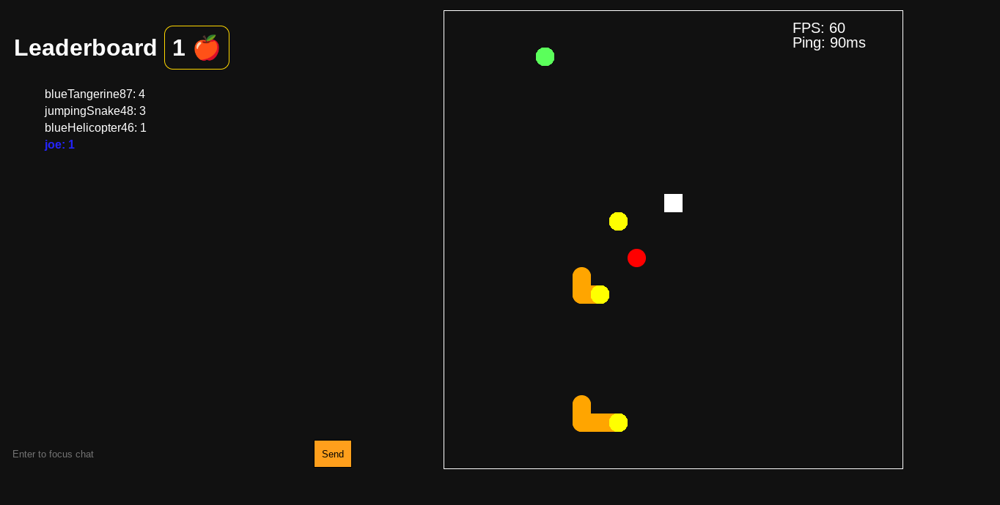
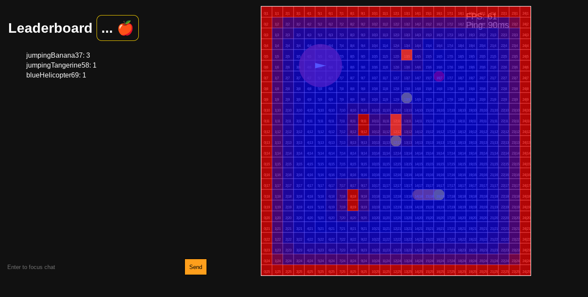

# Welcome to MultiSnake V2

Here is what changed from V1

### New Game UI

Migrated from HTML table to HTML canvas, this means 60 FPS no matter what.
Added better CSS styling, using the grid interface.

### Developer view

This view shows the spawn gradient (more on that later), coordinates of each point, and a grid.

### Revamped spawning system

This completely eliminates spawn camping. Heres how it works

1. The client sends a "request_optimal_spawn" request to the server, and passes the room it want to spawn into.
2. The server calculates a gradient of the map, so that dangerous zones are highlighted (on dev mode, this is the red spots).
3. The server picks the point with the lowest level of gradient, then checks in each direction what the gradient values are facing up, down, left, and right.
4. The direction with the lowest gradient is picked, then sent back to the client
5. The client displays this to the user, waits 1 seconds, then sends a 'spawn_request' back to the server, passing the optimal spawn recieved from the first couple steps. This allows to snake to be spawned int

### Completely remade Bots

- this time, they actually know what they are doing

#### Here is how I did it

1. If a room does not have 3 players, a bot is spawned in.
2. Each bot has a rate of mistakes. The higher the rate of mistake, the worse the bot (this ensures that they are not perfect, and makes them more human like. It also ensures no two bots are the same)
3. Every tick, the bot looks to change its direction towards the apple. If anything is in its way, it turns away from the obstacle
4. If it wants to turn back on itself, it instead picks a random direction on the opposite axis instead, so that it can avoid running into itself
5. Every tick, the bot picks a number 1-100. If the number is bigger than the rate of mistakes, a mistake is made. A mistake is any move that does not avoid an obstacle or move it towards it's goal

### Made the death screen a lot more interesting

This one was just random. A message is displayed in a random position 60 times a second, giving a crazy effect that I'm rather fond of

## Contributing

Submit a PR on the github, DM me on discord (sojs#8307), email me, comment on the repl, etc. Just reach out!
